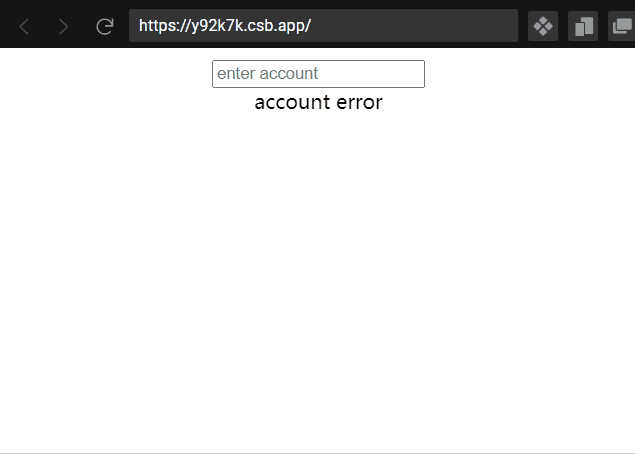

# @postor/react-form
yet another solution for react forms | 又一个 react 表单的解决方案



## usage | 使用

```
import {Provider,Consumer} from '@postor/react-form'

...
      <Provider>
        <Consumer>
          {({
            formData,
            validatingFields,
            errorFields,
            untouchedFields,
            register
          }) => (
            <div>
              {(() => {
                let { value, setValue, error, touched, validating } = register(
                  "account",
                  {
                    validate: async (val) => {
                      if (val.length < 2) throw `name length at least 2`;
                      if (val.length > 6) throw `name length at most 6`;
                      if (await exists(val)) throw `name already exists`;
                    }
                  }
                );
                console.log({ value, error, touched, validating });
                return (
                  <div>
                    <input
                      value={value}
                      onChange={(e) => setValue(e.target.value)}
                      placeholder="enter account"
                    />
                    {validating ? (
                      <span>validating...</span>
                    ) : touched && error ? (
                      <span style={{ color: "red" }}>{error}</span>
                    ) : null}
                  </div>
                );
              })()}
              {(() => {
                if (validatingFields.length) {
                  return (
                    <span>{`${validatingFields.join(",")} validating`}</span>
                  );
                } else if (errorFields.length) {
                  return <span>{`${errorFields.join(",")} error`}</span>;
                } else {
                  return (
                    <button onClick={() => alert(JSON.stringify(formData))}>
                      submit
                    </button>
                  );
                }
              })()}
            </div>
          )}
        </Consumer>
      </Provider>
...
```